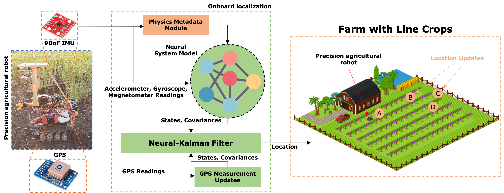
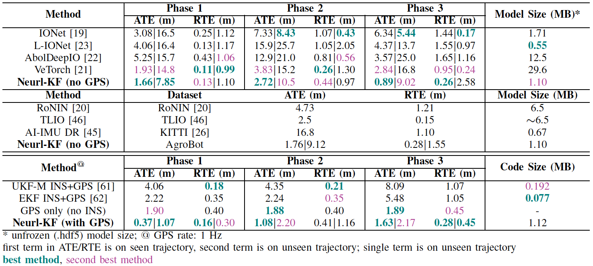

# Neural-Kalman GNSS/INS Navigation for Precision Agriculture




## Paper
https://ieeexplore.ieee.org/document/10161351 

## Video Demo
https://www.youtube.com/watch?v=9e3Q_9aTCQ4 

https://drive.google.com/file/d/1rcrO963Paldojj-992d1c_H6Uw6DQX_Y/view 

## Summary
Precision agricultural robots require high-resolution navigation solutions. In this paper, we introduce a robust neural-inertial sequence learning approach to track such robots with ultra-intermittent GNSS updates. First, we propose an ultra-lightweight neural-Kalman filter that can track agricultural robots within 1.4 m (1.4 - 5.8x better than competing techniques), while tracking within 2.75 m with 20 mins of GPS outage. Second, we introduce a user-friendly video-processing toolbox to generate high-resolution (+-5 cm) position data for fine-tuning pre-trained neural-inertial models in the field. Third, we introduce the first and largest (6.5 hours, 4.5 km, 3 phases) public neural-inertial navigation dataset for precision agricultural robots. The dataset, toolbox, and code are available at: https://github.com/nesl/agrobot.


## Code Architecture


- ```Agrobot Dataset```: Contains the 3-phase neural-inertial navigation dataset for precision agriculture. Visit the folder for more information
- ```Baselines```: Has 4 neural-inertial baselines (in Python) and 2 classical INS/GNSS baselines (in MATLAB)
- ```Neural Kalman IMU GNSS Fusion```: Contains our neural-Kalman filter algorithm for GNSS/INS fusion. Contains pretrained models for all three phases, jupyter notebooks for training these models (```sample_training_dsetX.ipynb```), notebooks to run the neural-Kalman filter (```neural_kalman.ipynb```), notebooks to perform transfer learning on pre-trained model (```fine_tuning.ipynb```), and notebooks to perform ablation study (```ablation_study.ipynb```).


## Required items 
- A GPU Workstation running Ubuntu 20.04.
- Python 3.8+ must be installed, preferably through Anaconda or Virtualenv, https://docs.conda.io/en/latest/, https://virtualenv.pypa.io/en/latest/
- Python package requirements are listed in ```requirements.txt```. Please install them before running the Python scripts. Note that Tensorflow 2.5.0 is a must. Tensorflow 1.x would not work.
- MATLAB R2020a++ with all toolboxes.


## Citation
Please cite this as:

Yayun Du, Swapnil Sayan Saha, Sandeep Singh Sandha, Arthur Lovekin, Jason Wu, S. Siddharth, Mahesh Chowdhary, Mohammad Khalid Jawed, and Mani Srivastava, “Neural-Kalman GNSS/INS Navigation for Precision Agriculture”, in 2023 IEEE International Conference on Robotics and Automation (ICRA), IEEE, 2023.

## Acknowledgements
Special thanks to Matt Conroy from GoodFarms and Andre Biscaro from UCANR for their field preparation. This work was supported in part by the CONIX Research Center, one of six centers in JUMP, a Semiconductor Research Corporation (SRC) program sponsored by DARPA; by the IoBT REIGN Collaborative Research Alliance funded by the Army Research Laboratory (ARL) under Cooperative Agreement W911NF-17-2-0196; by the Air Force Office of Scientific Research (AFOSR) under Cooperative Agreement FA9550-22-1-0193; by the National Science Foundation (NSF) under awards CNS-1705135, CNS-1822935, IIS-1925360, CNS-2213839, and CMMI-2047663; by the King Abdullah University of Science and Technology (KAUST) through its Sensor Innovation research program; and by the National Institute of Food and Agriculture, USDA under awards 2021-67022-342000 and 2021-67022-34200.


